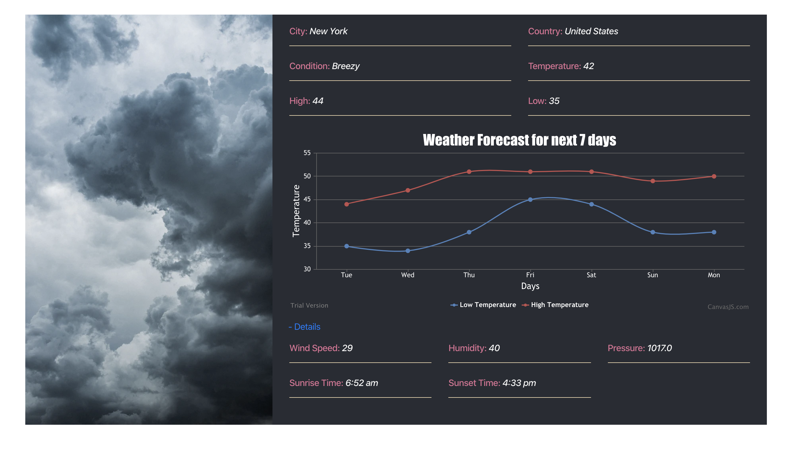

# React-Weather-App

<table>
<tr>
<td>

  The Weather app shows the current weather conditions in New York, USA. 

</td>
</tr>
</table>

## Requirements
+ Solution should be responsive
+ Use the the included `weather.json` file as your datasource (sample data from [Yahoo's Weather API](https://developer.yahoo.com/weather/))
+ Show the "current" conditions for New York:
  + Location (ie. New York, NY, USA)
  + Current weather description (ie. sunny)
  + Current temperature
  + Today's high temperature
  + Today's low temperature
+ Allow the user to toggle more data in the current conditions area:
    + Wind Speed
    + Humidity
    + Pressure
    + Sunrise/Sunset Time
+ Show the 7 Day forecast as a multi-line chart (use any charting library you would like)
  + Y axis should show the High and Low temperature as separate lines
  + X axis should show 7 days (starting with the "current" day)
  + The chart should have a tool tip that when activated shows:
    + Day of the week
    + High temperature
    + Low temperature
    + Weather description (ie. Breezy)
    
 ## Instructions
 + Git clone this repository
 + Open the folder - React Weather App
 + npm install
 + npm start
 
 ## Screenshot
 

    

